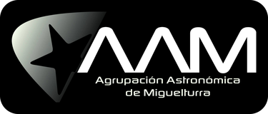

# ✦ ASTRO

[Español](README.md) · [English](README.md#in-english) · [Français](README.fr.md) · **Deutsch** · [Italiano](README.it.md) · [Português](README.pt.md)

**Dein Helfer für Astrofotografie-Nächte.**

Wenn du Deep-Sky-Fotografie machst, kennst du die Situation bestimmt: Du kommst von einer Aufnahmenacht mit Hunderten von Aufnahmen zurück und musst sie eine nach der anderen durchsehen. Bei welchen sind die Sterne verzogen? Bei welchen ist ein Satellit durchs Bild geflogen oder eine Wolke hereingezogen? Habe ich die Darks und Flats, die ich für diese Sitzung brauche?

ASTRO nimmt dir diese Arbeit ab. Es ist kostenlos, läuft auf **Mac** und **Windows**, gibt es auf **Spanisch**, **Englisch**, **Französisch**, **Deutsch**, **Italienisch** und **Portugiesisch** und hat drei Designs: **Tag**, **Nacht** und **Rot**, Letzteres für den Einsatz am Teleskop, ohne die Dunkeladaption zu verlieren.

---

## Was macht es?

**Es prüft deine Lights.** Es misst die Sterne jeder Aufnahme und sagt dir, welche in Ordnung sind, welche ein Problem haben und welche du besser aussortierst: längliche Sterne, Unschärfe, Spuren von Satelliten oder Flugzeugen, Wolken oder ein zu heller Hintergrund. Und es erklärt dir den Grund in ganz normalen Worten. Wenn deine Ausrüstung oder dein Himmel nicht so viel hergibt, stellst du mit den **Qualitätskriterien** per Schieberegler ein, wie streng bewertet wird, oder behältst nur die besten X % jedes Filters, und siehst dabei sofort, wie viele Aufnahmen durchkommen und welche als erste herausfällt. Wenn der Header das Objekt, den Filter, das Teleskop oder die Kamera nicht enthält (oder falsch), änderst du das für viele Aufnahmen auf einmal.

**Es behält die Nacht für dich im Auge.** Mit „Live“ beobachtet ASTRO den Ordner, in dem die ASIAIR (über das Netzwerk) oder N.I.N.A. die Bilder ablegen, und prüft jede Aufnahme, sobald sie fertig ist. Wenn Wolken aufziehen, die Sterne länglich werden, der Fokus wegläuft oder die Sequenz stehen bleibt, warnt es dich mit einem Ton und einer Mitteilung und zeigt dir in Diagrammen, wie die Nacht läuft. Du kannst auf dem Sofa bleiben, statt ständig nachsehen zu gehen. Und du kannst alles **auf dem Handy** verfolgen: Du scannst einen QR-Code und siehst dort die letzten Aufnahmen, das Diagramm und die Warnungen, mit Ton, Vibration und Rotmodus.

**Es sagt dir, ob sich ein Filter noch lohnt.** ASTRO stackt einen Teil und alle deine Aufnahmen jedes Filters und misst, ob das schwache Signal und die Details noch zunehmen oder ob du schon am Ziel bist, wie viele Stunden mehr nötig wären, um einen Unterschied zu sehen, und welcher Farbkanal am schwächsten ist.

**Es erklärt dir, warum eine Aufnahme danebengegangen ist.** Gib ihm die Logs der ASIAIR (das der Sitzung und das Guiding-Log von PHD2), und ASTRO verknüpft jede Aufnahme mit dem, was in diesem Moment los war: dem Guiding-RMS, ob sich das Guiding nach dem *Dither* beruhigt hatte, dem letzten Fokussieren, dem Meridianflip. Außerdem fasst es dir die Probleme jeder Nacht zusammen: eine Zentrierung, die nach dem Flip wegdriftet, Aufnahmen ohne Nachführung oder ein Guiding, das nach dem Nachfokussieren ausreißt.

**Es ordnet deine Kalibrierbibliothek.** Es speichert deine Bias, Darks und Flats, bewertet sie und sagt dir, was fehlt. Auf Knopfdruck zeigt es dir, welche Kalibrieraufnahmen du für jedes Objekt machen musst, und bereitet dir die Liste für die ASIAIR oder eine fertige Sequenz zum Laden in N.I.N.A. vor.

**Es bemerkt deine Sitzungen von selbst.** Sag ihm einmal, in welchen Ordnern die ASIAIR, N.I.N.A. oder dein Aufnahmeprogramm die Bilder speichern, und ASTRO prüft sie beim Start und alle zehn Minuten: Neue Aufnahmen werden analysiert und automatisch einsortiert, ohne dass du etwas hineinziehen musst.

**Es bringt Ordnung in Jahre voller Fotos.** Der Bereich **Archiv** indexiert deine Ordner aller Jahre, liest dabei nur die Header und kopiert nichts, und zeigt dir jedes Projekt mit seinen Stunden pro Filter und Saison. In jedem Projekt analysierst, sortierst und stackst du Schritt für Schritt.

**Es hilft dir, dein Ziel zu erreichen.** Für jedes Objekt siehst du, wie viele nutzbare Stunden du pro Filter hast, wie viele dir noch fehlen und wie viele Nächte du ungefähr noch brauchst. Und wie es sich Nacht für Nacht entwickelt: FWHM und Hintergrund jeder Sitzung, welche Nächte schwach waren (im Vergleich zum Üblichen des jeweiligen Setups und Filters) und wie stark sich das Signal-Rausch-Verhältnis mit einer weiteren Nacht wirklich verbessert. Schwache Nächte kannst du per Knopfdruck **aus dem Stack nehmen**, ohne etwas zu löschen, und im Eintrag jeder Aufnahme siehst du, **welches Dark, Flat und Bias beim Stacken zu ihr gehören** und was ihr fehlt.

**Und es sagt dir, wann.** Anhand deines Beobachtungsorts, des Mondes und der Höhe jedes Objekts zeigt dir ASTRO, welche Nächte des kommenden Monats sich für das eignen, was dir noch fehlt: Breitband, wenn kein Mond da ist, und Hα, OIII oder SII, wenn er scheint. In „Kommende Nächte“ siehst du auf einen Blick, was du heute Nacht und in den folgenden Nächten machen kannst, mit der stündlichen Vorhersage für die nächsten sieben Tage (Wolken, Luftfeuchtigkeit, Tau und Wind). Du kannst mehrere Orte speichern, jeden mit seinem Horizont (die Bäume, das Haus oder die Kuppel), und ASTRO zeichnet dir die Höhe jedes Objekts für heute Nacht. Und wenn du etwas Neues suchst, schlägt dir **„Was fotografiere ich?“** Objekte vor, die ins Bildfeld deiner Ausrüstung passen, und bereitet dir den Plan für N.I.N.A. oder die ASIAIR vor.

**Es sagt dir, was du heute Nacht aufbauen sollst.** In „Meine Ausrüstung“ trägst du deine einzelnen Komponenten ein: Teleskope, Reducer, Kameras und Filter. Jede Nacht probiert ASTRO alle Kombinationen durch und schlägt dir einen Plan vor: welches Objekt, **welches Teleskop mit welcher Kamera** (die Kombination, die es am besten einrahmt und abtastet), **mit welchem deiner Filter du anfangen solltest** je nach Mond und **wie lange du jede Aufnahme bei deinem Himmel belichten solltest** (mit dem SQM- oder Bortle-Wert deines Orts). Wenn eine Nacht nicht ausreicht, schlägt es dir ein **Projekt** mit den Stunden vor, die du sammeln solltest, und zählt zusammen, was du aufnimmst. Und es schickt dir das Ganze **per WhatsApp**: auf Knopfdruck oder automatisch jeden Abend zu einer Uhrzeit deiner Wahl. Den Plan gibt es auch **als Sequenz für N.I.N.A.** oder als Liste zum Übertragen in die **ASIAIR**, und am nächsten Morgen bekommst du die **Zusammenfassung der Nacht**: wie viele Aufnahmen brauchbar sind, die Stunden pro Filter, wie das Projekt vorankommt und welche Kalibrierung fehlt.

**Gruppenprojekte.** Wenn ihr das zu mehreren Vereinsmitgliedern macht, teilt ihr einen Ordner (Google Drive, Dropbox, OneDrive oder ein Netzlaufwerk): Jeder legt seine Aufnahmen im Ordner seines Setups ab, und das ASTRO aller Beteiligten führt sie automatisch im selben Projekt zusammen, mit dem Eintrag und dem Beitrag jedes Setups.

**Deine Daten bleiben nicht eingesperrt.** Jedes Objekt lässt sich als Projekt in einer ZIP-Datei mit offenen Formaten exportieren (JSON und CSV, das sich in Excel öffnen lässt), mit der Bewertung jeder Aufnahme und der zugehörigen Kalibrierung, und auf Wunsch auch mit den Aufnahmen selbst, den Darks, Flats und Bias und den Stacks. So kannst du es archivieren, an einen Mitstreiter weitergeben oder auf einem anderen Computer oder in einem anderen Programm damit weiterarbeiten; und es lässt sich wieder in ASTRO importieren, ohne dass etwas doppelt angelegt wird.

**Es stackt für dich.** Wenn du Siril installiert hast (ebenfalls kostenlos), stackt ASTRO jedes Objekt nach Filtern mit den passenden Kalibrierdaten. Hast du dasselbe Objekt mit mehreren Teleskopen oder Kameras aufgenommen, stackt es jedes Setup einzeln, kombiniert sie danach in einem gemeinsamen Maßstab und Bildausschnitt und zeigt dir in der Übersicht des Objekts, wie viel du mit jedem gesammelt hast. Im Startfenster kannst du ein **Projekt mit mehreren Setups** anlegen, mit deinen eigenen oder denen von Mitstreitern: Jedes Setup hat seinen Eintrag mit allen Werten (Kamera, Rotator, Filter, Beitrag zum Projekt) und Empfehlungen, wie du mehr herausholst.

**Und es misst mit deinen Bildern.** Der Bereich **Wissenschaft** macht aus deinen Aufnahmen Messungen: die **Helligkeit deines Himmels** in Magnituden pro Quadratbogensekunde (wie ein SQM, aber genau in Blickrichtung des Teleskops), die **Grenzgröße** jeder Aufnahme oder jedes Stacks, die Größe der Sternabbildungen und die Transparenz der Nacht, kalibriert mit den Sternen des **Gaia**-Katalogs. Es speichert die Messreihe Nacht für Nacht und Ort für Ort, und jede Messung kommt mit ihrem **Rückverfolgbarkeitspaket** (Methode, Katalog, Siril-Skript und Fingerabdrücke der Dateien), damit du sie in einem Bericht oder einem Fachartikel verwenden kannst. Außerdem misst es **veränderliche Sterne** für die **AAVSO**: Es lädt die offizielle Vergleichssequenz herunter, misst jede Aufnahme, zeichnet die Lichtkurve und legt den Bericht im Format AAVSO Extended bereit, fertig zum Hochladen in WebObs. Es misst **Exoplaneten-Transits** für **ExoClock**: Es sagt dir, welche Transits in den nächsten Nächten von deinem Ort aus zu sehen sind, wählt die Vergleichssterne aus Gaia aus, fittet den Transit und gibt den Mittenzeitpunkt in BJD_TDB mit seinem Fehler und dem O−C an, mit einer Kurve, die fertig zum Hochladen ist. Es macht **Astrometrie von Asteroiden und Kometen**: Es fragt beim JPL nach, welche Objekte in deinem Feld sind, misst ihre Position mit den Gaia-Sternen, vergleicht sie mit der Ephemeride und erstellt den **ADES**-Bericht für das Minor Planet Center. Es zeichnet das **HR-Diagramm eines Sternhaufens**: Mit zwei Stacks (blau und grün) misst es alle Sterne, findet die Mitglieder mit Gaia und berechnet Entfernung und Rötung. Und es macht **Spektroskopie** mit einem Gitter vor der Kamera (etwa einem Star Analyser): Es extrahiert das Spektrum, kalibriert es mit den Linien des Wasserstoffs und der Luft, misst die Linien und speichert es als FITS für ISIS oder VSpec.

**Und es zeigt dir das Ergebnis.** Zum Schluss entwickelt ASTRO das Bild für dich: Es entfernt den Hintergrundgradienten, gleicht die Farben ab und streckt es, und wenn du die Filter hast, erstellt es auch die Versionen RGB, LRGB, SHO (die Hubble-Palette) oder HOO. Nie mehr eine schwarze Datei öffnen, ohne zu wissen, ob etwas daraus geworden ist: Du siehst es sofort. Und wenn du das Bild fertig bearbeiten willst, öffnet es ein Knopf direkt in GIMP, Photoshop, PixInsight oder dem Programm, das du nutzt.

---

## So fängst du an

1. Geh auf **[Releases](../../releases/latest)** und lade die Datei für deinen Computer herunter:
   - Mac mit Apple-Chip (M1, M2, M3, M4…): **ASTRO-Mac-AppleSilicon.zip**
   - Mac mit Intel-Prozessor: **ASTRO-Mac-Intel.zip**
   - Windows 10 oder 11: **ASTRO-Windows.exe**
2. **Doppelklicke darauf.** ASTRO installiert sich selbst und aktualisiert sich ab dann auch selbst (und zeigt dir die Neuigkeiten jeder Version).
3. Wähle die Sprache und den Ordner, in dem du deine Bilder speichern willst. Er kann auf einer externen Festplatte liegen. Willst du es dir erst ansehen? Klicke auf **„Mit Beispieldaten ansehen“** und erkunde es mit Beispielaufnahmen und -messungen, ohne deine eigenen Daten anzurühren.
4. Im **Startfenster** wählst du, womit du anfangen willst: Jeder Bereich (Aufnahmen hinzufügen, Meine Objekte, Archiv, Mehrere Setups, Mit Siril stacken, Kommende Nächte, Was fotografiere ich?, Live-Sitzung, Kalibrierung und Wissenschaft) hat sein eigenes Bild und öffnet sich im selben ASTRO-Fenster, ohne Browser; „Alle Bereiche“ oben links bringt dich zurück zum Start. Zieh den Ordner einer Aufnahmenacht hinein und lass ASTRO den Rest machen.

Auf dem **Mac** ist ASTRO signiert und von Apple geprüft: Es öffnet sich per Doppelklick, ohne Warnung.

Unter **Windows** warnt dich dein Computer beim ersten Mal, dass das Programm nicht signiert ist (das ist bei kostenlosen Programmen von Hobbyentwicklern normal): Klicke auf *Weitere Informationen → Trotzdem ausführen*. Danach kommt die Meldung nicht mehr.

---

## Deine Bilder gehören dir

ASTRO arbeitet auf deinem Computer. **Es lädt nichts ins Internet hoch**: Es prüft nur ab und zu, ob es eine neue Version gibt; wenn du „Kommende Nächte“ nutzt, fragt es bei Open-Meteo.com die Wettervorhersage für deine Gegend ab und sendet dabei nur deine ungefähre Position (lässt sich abschalten); in „Was fotografiere ich?“ zeigt es Himmelsbilder vom CDS-Dienst in Straßburg; und in „Wissenschaft“ fragt es den Gaia-Katalog ab (bei der ESA oder beim CDS) und sendet dabei nur die Koordinaten des gemessenen Feldes sowie, bei veränderlichen Sternen, den Namen des Sterns an die AAVSO (VSX und VSP), niemals deine Bilder; für die Transits lädt es die Planetenliste von ExoClock und aus dem Exoplaneten-Archiv der NASA herunter, und für die Asteroiden fragt es beim JPL mit der Feldmitte, der Uhrzeit und den Koordinaten deines Orts an. Wenn du das automatische WhatsApp aktivierst, wird die abendliche Nachricht über CallMeBot verschickt, einen kostenlosen Dienst eines Drittanbieters. ASTRO kopiert deine Aufnahmen in seinen Ordner, ohne die Originale anzurühren, oder, wenn dir das lieber ist, analysiert und stackt sie dort, wo sie liegen, ohne sie zu kopieren.

---

## Das ist eine Testversion

ASTRO ist in der **Beta**, es kann also noch Fehler haben. Wenn dir etwas seltsam vorkommt oder dir etwas fehlt, sag es mir direkt aus dem Programm heraus: **Weitere Optionen → Problem oder Vorschlag melden**. Alles hilft, auch zu wissen, was dir gefällt.

Wenn du es testen willst, wirf einen Blick in die **[Anleitung für Tester](GUIA-BETA.de.md)**.

---

## Wer dahintersteckt

ASTRO wurde von **Tomás Moreno González** entwickelt, Astrofotograf und Wissenschaftsvermittler, Mitglied von **Astrocitas**, der **Asociación Astronómica Azarquiel (Piedrabuena, C.Real)** und der **Agrupación Astronómica de Miguelturra (C.Real)**.

  &nbsp;&nbsp;&nbsp;
  &nbsp;&nbsp;&nbsp;
  

Es ist aus einem ganz konkreten Bedürfnis entstanden: weniger Zeit mit dem Durchsehen von Bildern verbringen und mehr Zeit mit dem Blick in den Himmel.

Du willst mehr darüber wissen, wie es gebaut ist oder wie man neue Versionen veröffentlicht? Das findest du in **[LEEME.de.md](LEEME.de.md)**.
